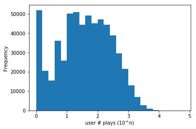
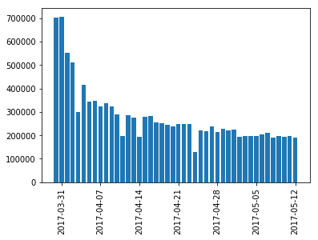
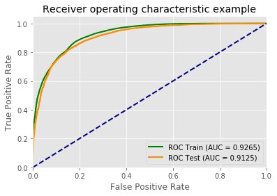

# Capstone Project Report: Music Box Churn Prediction and Recommendation system 

## 1. Project Summary

This purpose of this project is to use music box log data to predict churn, including information on songs played, user profile, searching activities. This project builds a demo for analyzing large user record level data and analyze user behaviors. A recommendation system based on Collaborative Filtering is built and reaches an rmse of
0.567.

Churn is defined by inactivity in fixed 14 days window. It is predicted using the users' behavior pattern in a 30 day window before that 14 day window. 

Churn prediction is an important operation problem. Effective targeting of those who might churn and act earlier is crucial to keep the product's core users. As such, features are generated from the log file, including the frequency, recency of events, total playing time, songs fully played and other playing behaviors such as the mean and standard deviation of song playing time.

Machine learning models, such as random forest, gradient boosting and Logistic regression are applied on the training data to predict the test data set. The end churn prediction accuracy is around 0.92 on the training and 0.91 on the testing data set, which is 14% more than the 80% baseline.

Variables that explain most of the variation is recency in a 30 days windows, total playing time in two weeks and event frequency in the most recent weeks.

The result provides important insights to what measures that the product operation should keep monitoring.
Also, the accurate prediction results can suggest the right time window (decrease in frequency for two weeks, for example) when the operation system should try to intervene and influence the user in order to retain more current users of the music box. 

The recommender systems is based on Collaborative filtering, which is commonly used . The rmse on test data is 0.567 which is a lot smaller than the bench mark performance RMSE~1.2-1.5. Sample recommendation of songs and user ids are displayed.

The major problem of this project is the sheer size of data. It is hard to load the entire dataset into a pandas dataframe on a local computer. This project builds the basic tools and practices for analyzing large, user-record level data, which would be impossible to do so directly on a computer.

The processing code is written in Pyspark to make use of the big data technology in Spark when such data infrastructure is available. In this applicaiton, a user id level downsampling (randomly select 10% of users) is applied, so that the data processing and modelling can be accomplished on a personal computer. But it will be scalable when running on a spark cluster on Google Cloud or other cloud computing infrastructure. 

## 2. Data Downloading and Processing 
(For the exact code, see 1_download data.ipynb, 2_unpack_and_clean_files.sh, and 3.etl_down_sampling.ipynb)

Scripts are prepared for automaticaly downloading and processing data, including extracting the date information from file names. Due to the large size of the data, I tried to use Spark when I process the data and try to use the SparkMLlib to train the model. Since I currently don't access to a Cloud Spark cluster, I applied a user id level downsampling to conduct the analysis on 10% of the users as a demo. To do so, I first aggregated record at the user_id level to get all the distinct user_ids. Then, I randomly split the data into 10 fold and only pick one fold for the analysis.

But the code can be modified a little so that it can also be run on a spark cluster and no downsampling would be needed. 
and that would be my next step of bringing things to google cloud DataProc.

##  3. Data cleaning and transformation
(for the exact code, see 4.feature_label_generation_with_spark.ipynb )

Data cleaning are applied before the feature engineering steps.

Missing values and records with irregular data, e.g. nonnegative play time or song length
are excluded when forming the variables.

Irregular users that has unusually long playing time (greater than a 99.9 percentile) are
are considered bots and are consequently excluded from the data.

## 4. Feature engineering
(for the exact code, see 4.feature_label_generation_with_spark.ipynb )

In terms of prediction windows, I defined a label window of 14 days and a feature
window of 30. In others words, churn is defined as inactivity from 2017-04-29 to
2017-05-12. And all the prediction are based on observing the behavior in a time period 30 days before 04-29, i.e.
2017-03-30 to 2017-04-28.

Most features are related to behavior. Features are generated by activity type (search, play, download)
and by different window size (one day, a week, a month etc.). The exact variables including the following:
frequency, recency of events, total playing time, songs fully played and other playing behaviors such as
the mean and Standard deviation of song playing time; Frequency of certain Events over a fixed Time Window;
Recency is last event time from a Snapshot of time; Total playing time of songs by user for a certain time window.
The mean and Standard deviation of play time percentage of the entire song length. 

User profile is a bit limited for the given data, so User preferred device, i.e. android and IOS users is the main characterization of this aspect.

## 5.  Exploratory data analysis
* Evaluating the playing time to distinguish bots.

* Counting the churned users in the time windows, about 60% users are churned, which is not surprising according to past experiences in the industry.

* Plotting the events against time, a declining trend after early April.

## 6. Modeling
(for the exact code, see 5.train_model_sklearn.ipynb )

I built the user churn prediction model based on user behavior variable in a 30 days window to predict churn behavior of users
in the next 10 days. Machine learning models, such as the random forest, gradient boosting and Logistic regression are applied on the training data to predict
the test data set. The parameters are a combination of hand tuning and grid search.

The AUC of random forest is 0.9125 on the testing dataset, 0.85 Precision and 0.89 recall. Similar result for Gradient boosting.
AUC of Logistic regression is at 0.81 for the testing set.

The end churn prediction accuracy is around 0.92 on the training and 0.91 on the testing data set, which is 14% more than the 80% baseline.

Variables that explain most of the variation is recency in a 30 days windows, total playing time in two weeks and event frequency in the most recent weeks.

## 7. Recommendation system 

(for the exact code, see 6.train_model_sklearn.ipynb )

Collaborative filtering is commonly used for recommender systems. We make predictions (filtering) about the interests of a user by collecting preferences or taste information from many users (collaborating). The underlying assumption is that if a user A has the same opinion as a user B on an issue, A is more likely to have B's opinion on a different issue C than to have the opinion on C of a user chosen randomly.

A few data cleaning steps were applied. Records with missing song ids, or too short (1s) or too long (more than 5 minutes) are exclueded. To guarantee the quality of the recommendation system, it is built only on active users with at least 5 songs played for the data period. 

Since the log data that we have doesnt' have users' rating on the song, a proxy for rating using playtime/song_length, known as 'percent' is used. 

The rmse on test data is 0.567 which is a lot smaller than the bench mark performance RMSE~1.2-1.5. 

To demonstate the use of the recommendation system, sample outputs are displayed below. 

Top 10 songs recommendations for each user

+---------+--------------------+

|      uid|     recommendations|

+---------+--------------------+

| 35556737|[[6762450, 103.46...|

| 72854913|[[6762450, 70.460...|

|149954144|[[6762450, 64.763...|

|165428768|[[6762450, 75.927...|

|167415658|[[6762450, 54.702...|

|167570315|[[6762450, 125.99...|

|167575737|[[6762450, 121.32...|

|167579413|[[3288014, 52.417...|

|167580826|[[6762450, 41.008...|

|167584025|[[6762450, 130.17...|

|167587488|[[6762450, 105.33...|

|167588969|[[6762450, 70.224...|

|167590565|[[6762450, 154.22...|

|167595909|[[3288014, 63.964...|

|167597788|[[3288065, 121.96...|

|167605713|[[3288065, 60.772...|

|167608347|[[6762450, 70.228...|

|167627248|[[6762450, 104.45...|

|167645953|[[6762450, 72.958...|

|167655696|[[6762450, 52.226...|

+---------+--------------------+

 Top 10 user recommendations for each song

+----------+--------------------+

|   song_id|     recommendations|

+----------+--------------------+

|-789968706|[[168197794, 0.98...|

|      1645|[[168574955, 4.59...|

|     58305|[[168870872, 3.02...|

|     69042|[[168197794, 1.89...|

|     77422|[[168959539, 0.82...|

|     78064|[[168197794, 1.21...|

|     78120|[[168574955, 2.03...|

|     78400|[[168018103, 1.18...|

|     79361|[[168574955, 0.76...|

|     81349|[[168870872, 0.08...|

|     87724|[[167610432, 1.93...|

|     90228|[[168870872, 2.83...|

|     92834|[[168197794, 1.45...|

|     92959|[[169032223, 1.10...|

|     94265|[[168574955, 3.88...|

|     95994|[[168870872, 3.58...|

|     96393|[[168870872, 0.27...|

|    104508|[[168870872, 0.17...|

|    104656|[[168948486, 0.05...|

|    107032|[[168751937, 1.37...|

+----------+--------------------+

## 8. Conclusion and suggestion

This project builds a demo for the right tool to use and the right practice to apply, when  analyzing large user record level data. This type of analysis on user behavior would not be possible on personal computers without these preprocessing steps.

The result provides important insight to what measures that the product operation should keep monitoring that decides whether the user would churn or not. 

The accurate prediction result can suggest the right time when the operation system should try to intervene and influence the user in order to retain more current users of the music box.

Current users are important asset to the product and churn prevention is crucial to guarantee income inflows. Accurate churn prediction provides the right users to target and the right time to intervene, providing value to the production operation process.

The recommendation system built is quite accurate and can help improve the users experience on using the music box.
