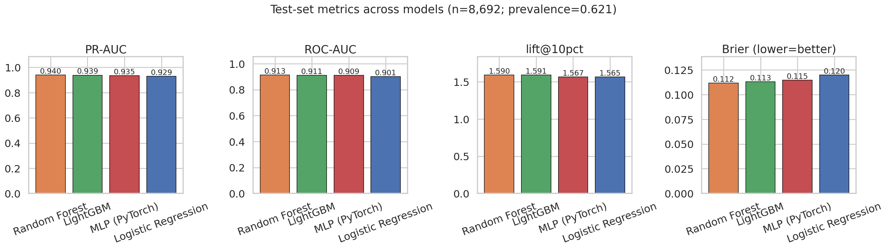
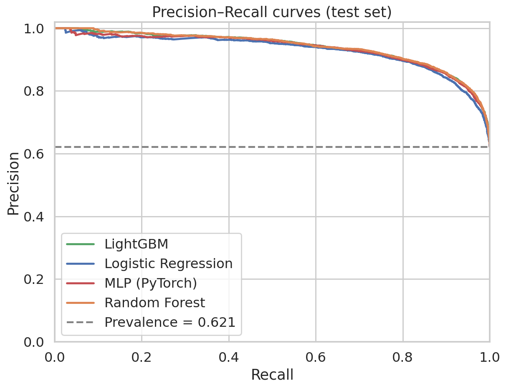
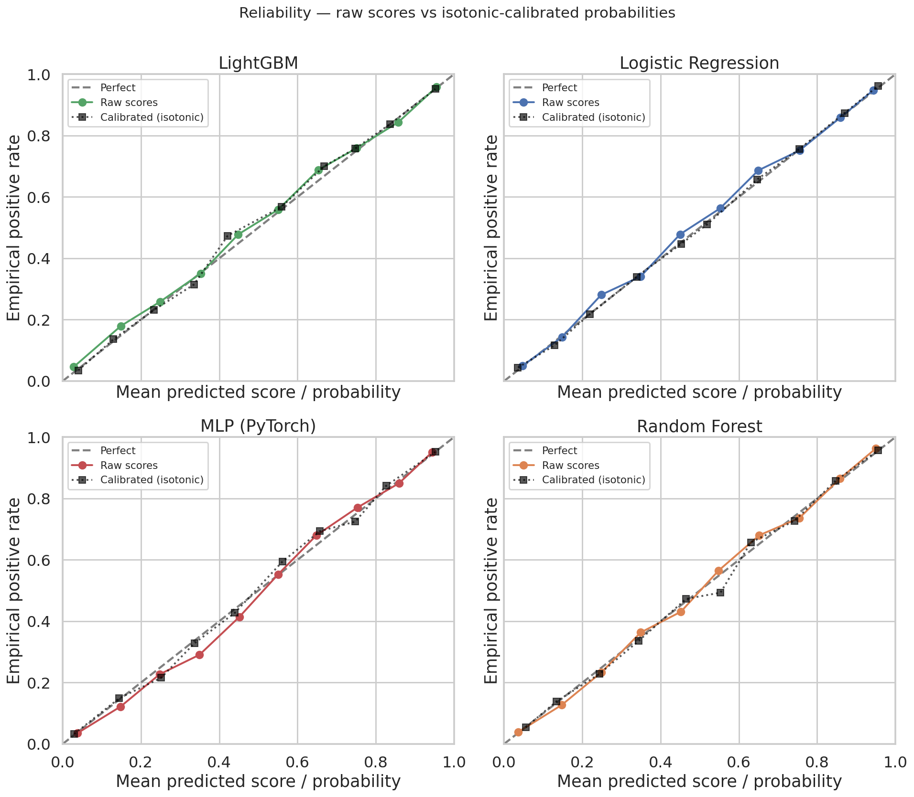
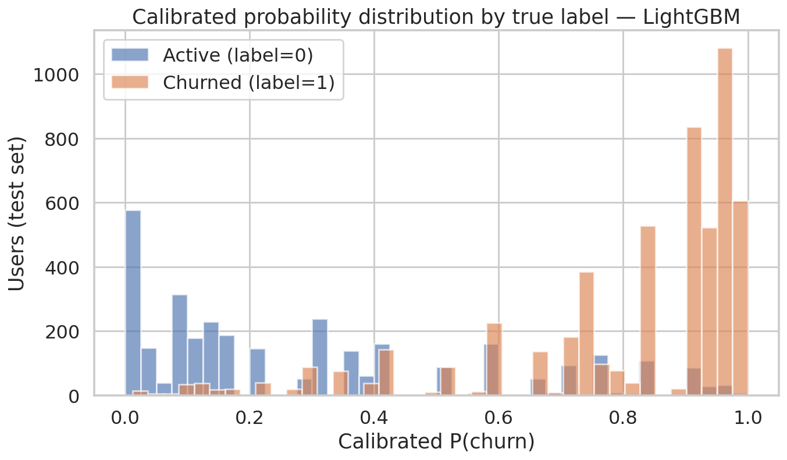
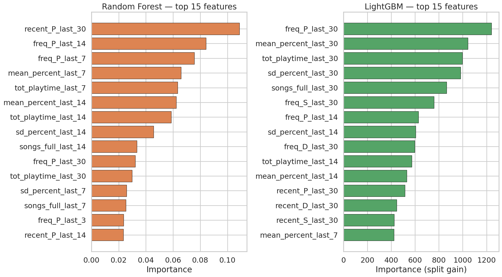
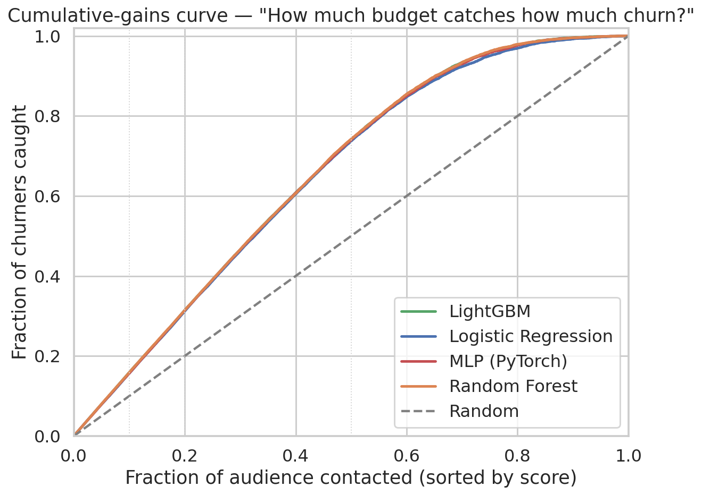
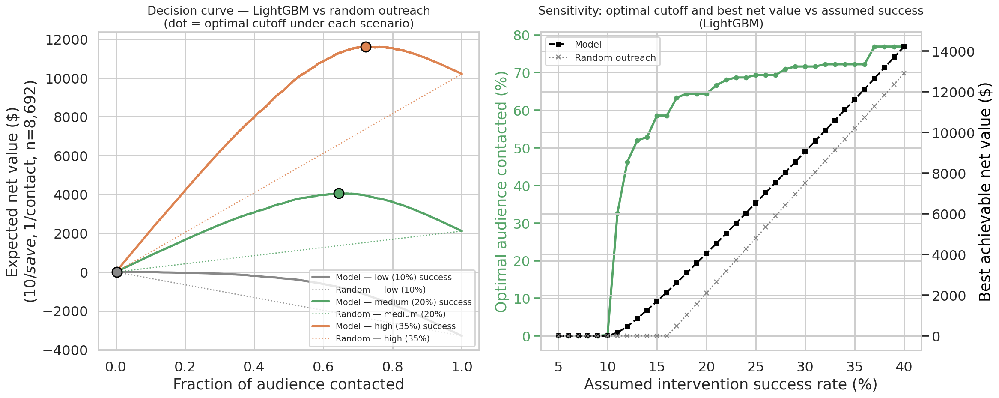

# Music Box churn-risk scoring — results report

A churn-risk scoring system for the Music Box dataset (~58k users) that
goes from raw feature vectors → calibrated probabilities → a budget-aware
decision rule that tells lifecycle marketing **who to contact and when
it stops paying off**.

---

## TL;DR

> **The win isn't the 0.94 PR-AUC — it's that calibrated probabilities
> turn the model into a dollar-value decision system.**
>
> On the 8,692-user test set, at the locked unit economics
> ($1/contact, $10 per saved user, 20% intervention success), the
> model picks an **optimal cutoff at the top ~64% of risk-scored users**
> and generates **$4,052 in expected net retention value** — **+92%
> over untargeted outreach** to the same audience size, and +∞ over
> blanket outreach (which loses money below ~16% intervention success).
>
> Below 10% success, no outreach pays off and the model says so. Above
> 30%, the model still helps prioritize but the gap to random shrinks.
> The model isn't just predicting churn — it's telling marketing **what
> intervention success rate they need to clear**, and **what the optimal
> audience size is at any given rate**.

| Intervention success | Optimal audience % | Net value (model) | Net value (random) | Model lift |
|---:|---:|---:|---:|---:|
| 10% | 0% (don't contact anyone) | $0 | $0 | — |
| 15% | 59% | **$1,698** | $0 | break-even gap |
| 20% | 64% | **$4,052** | $2,106 | +92% |
| 25% | 69% | **$6,532** | $4,806 | +36% |
| 30% | 72% | **$9,062** | $7,505 | +21% |
| 35% | 72% | **$11,615** | $10,204 | +14% |

*All values on the 8,692-user test set. See [§ 4](#4--so-what--from-scores-to-spend-decisions) for derivation.*

---

## 1 · Why — the business problem

Music Box loses **~62% of its users to inactivity in any 14-day window**
— typical for free-tier consumer apps. Retention teams have a finite
budget for outreach (push notifications, discount nudges, re-engagement
emails), so they need to answer three questions simultaneously:

1. **Who is most likely to churn?** (ranking)
2. **What's the probability each user will churn?** (calibration)
3. **Given a unit cost per contact and a unit value per save, who should
   we actually contact and how big should the audience be?** (decision)

A model that only answers #1 produces a leaderboard. A model that
answers #2 lets marketing reason about expected value. A model that
answers #3 can directly drive the campaign. This pipeline answers all
three.

---

## 2 · How — pipeline

```
Processed_data/df_model_final.csv  (57,943 users × 45 features + label)
   │
   ├─→ Schema validation, dedupe (10 dup uids), stratified 70/15/15 split (seed=42)
   │
   ├─→ Preprocessor: StandardScaler(numeric) + OneHotEncoder(device_type)
   │
   ├─→ Train: LR / RF / LightGBM / PyTorch MLP behind a unified ModelHandle
   │           ↓
   │       raw ranking score (uncalibrated)
   │
   ├─→ Calibrate: IsotonicRegression fit on val (raw_score, label)
   │           ↓
   │       calibrated P(churn) — usable in expected-value math
   │
   ├─→ Threshold policy: max-F1 / top-k / precision-floor / recall-floor
   │
   └─→ batch_score.py → ranked CSV/parquet with both raw `score` and `prob_churn`
                       + audience_top50.csv export
```

### 2.1 Data — the underlying signal

| | |
|---|---|
| Modeling table | 57,943 users × 45 numeric features + `device_type` + `label` |
| Feature window | 30 days (2017-03-30 → 2017-04-28) |
| Label window | 14 days forward (2017-04-29 → 2017-05-12) |
| Label rule | Inactive throughout label window → churn (1) |
| Class balance | ~62% churn / 38% active |

Five feature families, computed at multiple windows (1, 3, 7, 14, 30 days):
**frequency** (event counts), **recency** (days since last event), **total
playtime**, **songs fully played** (≥80% completion), and
**play-completion %** (mean + stddev). Plus one categorical:
`device_type` (iPhone vs Android/other). Full provenance: [DATA.md](DATA.md).

### 2.2 The model isn't the headline

All four model families land within ~1 PR-AUC point of each other:



| Metric | Random Forest | LightGBM | MLP | Logistic Reg. |
|---|---:|---:|---:|---:|
| **PR-AUC** | **0.940** | 0.939 | 0.935 | 0.929 |
| ROC-AUC | 0.913 | 0.911 | 0.909 | 0.901 |
| lift@10pct | 1.59 | 1.59 | 1.57 | 1.57 |
| Brier (lower = better) | **0.112** | 0.113 | 0.115 | 0.120 |

PR curves overlap so tightly the lines are nearly indistinguishable:



**Pick by ops profile (training time, memory, deployment surface), not
accuracy.** This report uses LightGBM as the primary model from here on
because it trains in seconds and serializes small.

### 2.3 Calibration — the key step that unlocks the decision system

Raw model outputs from any of these algorithms are **ranking scores**:
the order is meaningful, the absolute number isn't a probability you
can multiply by money. A score of 0.92 doesn't mean "92% chance this
user churns" — it means "this user is near the front of the queue".

Calibration fixes that. We fit an `IsotonicRegression` on the validation
split's `(raw_score, label)` pairs and apply it at scoring time. After
calibration, `prob_churn` reads as an actual probability.



**Surprising finding:** these models are already nearly calibrated out
of the box (raw and calibrated points lie on top of each other along
the diagonal). Brier score barely moves (test Brier change ≤0.2% per
model after isotonic fitting). That's atypical for tree ensembles, which
usually need calibration before their probabilities mean anything. We
ship the calibrator anyway because:

1. It costs nothing at inference time and removes any "just trust us"
   on the probability framing.
2. Future model retrains might *not* be naturally calibrated; the slot
   exists.
3. Downstream consumers can read `prob_churn` from the batch-score
   output without needing to know whether calibration was load-bearing
   for that particular run.

### 2.4 Score distribution — clean separation



Churned users (orange) pile up near `prob_churn = 1.0`; active users
(blue) pile up near 0. The overlap zone in the middle (~0.4–0.7) is
where score-based prioritization adds the most value over random
selection — these are the borderline users.

### 2.5 What drives the score



**Recency wins.** `recent_P_last_30` (days since last play in the 30-day
window) tops the RF chart. `freq_P_last_30/14` (recent play counts) are
top-3 across both tree models. Engagement-quality features
(`mean_percent_last_*`, `tot_playtime_last_*`) cluster in the top 10
— *how* a user listens is almost as informative as *whether* they listen.

---

## 3 · So what — from scores to "who should we contact"

### 3.1 The ranking question — cumulative gains

If marketing has budget to contact some fraction of users, ranked by
risk, **how many true churners do they catch?**



| Audience contacted | Churners caught | Lift over random |
|---:|---:|---:|
| top 5% | 8.0% | 1.6× |
| top 10% | 15.9% | 1.6× |
| top 20% | 31.5% | 1.6× |
| top 30% | 46.6% | 1.6× |
| top 50% | 73.9% | 1.5× |

**Top half catches three-quarters of churners.** This curve answers
"how concentrated is the signal" but doesn't tell you what audience
size you should actually pick. That requires unit economics.

### 3.2 The decision question — net value vs audience size



**Left panel.** Expected net dollar value if we contact the top-k%
audience, under the locked unit economics ($1 per contact, $10 per
saved user). Three intervention-success scenarios. The dot marks the
optimal cutoff per scenario.

The story:

- **Low success (10%):** no outreach pays off. Even contacting
  guaranteed churners loses money: $10 × 0.10 = $1, exactly the
  contact cost. Model and random both flatline. *The model correctly
  tells marketing "don't run the campaign."*

- **Medium success (20%):** model peaks at **64% audience contacted →
  $4,052 net value**. Random outreach to the same audience nets only
  $2,106. *The model nearly doubles the campaign's value.*

- **High success (35%):** model peaks at 72% → $11,615. Random nets
  $10,204. *Gap narrows because high success rate forgives sloppy
  targeting; the optimum is "contact almost everyone".*

**Right panel.** As intervention success rate varies from 5% to 40%,
two things change:

- The **optimal audience size** (green) ratchets up from 0% to ~75% —
  more aggressive outreach as success improves.
- The **best achievable net value** (black solid = model, dotted =
  random) grows roughly linearly above the break-even success rate
  (~10–15%). The model–random gap is widest in the **15–25% success
  band** — exactly where careful targeting matters most.

### 3.3 What this tells lifecycle marketing

A PM can use this output to answer questions a model alone can't:

| Question | Answer mechanism |
|---|---|
| "Should we run the campaign?" | Decision curve at your assumed success rate. If the optimum is at 0% audience, **don't**. |
| "What audience size should we target?" | Optimal cutoff from the decision curve. Read off `prob_churn` threshold from the ranked CSV. |
| "What's the campaign worth?" | Net value at the optimum, scales linearly with user count. |
| "What success rate do we need to clear?" | The break-even point on the decision curve (~10% for the locked $1/$10 economics). |
| "What if our cost or LTV assumptions are wrong?" | Re-run the decision-curve script with new constants; re-read the optimum. |

### 3.4 Operational output

Each `batch_score` run writes a ranked CSV with both columns:

```csv
uid,score,prob_churn,rank,above_threshold
168283987,1.0000,0.9876,1,1
168432321,0.9997,0.9856,2,1
168983889,0.9970,0.9823,3,1
...
```

- `score` — raw ranking score; use this if you only need an ordering.
- `prob_churn` — calibrated probability; use this for expected-value
  math (cost-curves, dollar projections, threshold selection).
- `rank` — 1-indexed position by `score`.
- `above_threshold` — boolean, whether the row is above the
  threshold-policy cutoff saved with the model run.

Plus `audience_top50.csv` — the highest-risk 50 users, ready to drop
into a campaign pipeline.

---

## 4 · Honest framing & known limits

These are load-bearing — without them the dollar numbers above are misleading.

1. **Unit economics are assumed, not measured.** `$1/contact` and
   `$10/save` come from the locked plan ([README.md](README.md) §
   Locked decisions), as a sensitivity-analysis convention. Real LTV +
   real channel cost will move the numbers but the *shape* of the
   decision curves doesn't change.

2. **Intervention success rate is a model parameter, not data.** We
   don't have a holdout group of "users who would have churned but
   were contacted and didn't." That's what an A/B retention test
   would measure. The decision curve scans 5%–40% to show how
   sensitive the answer is.

3. **Probabilities are calibrated on this snapshot only.** The
   reliability check is on val and test from the same 2017-04-28
   snapshot. There is no temporal split because the dataset has no
   timestamp column and raw logs are gone (see [DATA.md](DATA.md) §5).
   In production, calibration must be re-fit on new data periodically.

4. **The "monitoring" report is split-stability, not real drift.** With
   one snapshot, train-vs-test PSI measures sampling variance. Real
   drift requires multiple snapshots. See `output/monitoring_report.md`
   header banner.

5. **No real-time inference.** 30-day rolling features need raw event
   logs to recompute at request time; logs are gone. Batch scoring
   matches how lifecycle teams actually consume churn scores.

---

## 5 · How to reproduce

```bash
make install-dev
make validate-data
make train-lr train-rf train-gbm train-mlp   # ~30s total
PYTHONPATH=src python3 scripts/generate_report_figures.py
make batch-score RUN_DIR=$(ls -td artifacts/gbm_* | head -1) \
                 INPUT=Processed_data/df_model_final.csv
# → output/predictions_<ts>.csv with score + prob_churn columns
```

Each run dir is self-contained and portable — `model.{pkl,pt}`,
`preprocessor.pkl`, `calibrator.pkl`, `metrics.json`, `threshold.json`,
`feature_schema.json`, `model_card.md`, `evaluation_report.md`.
